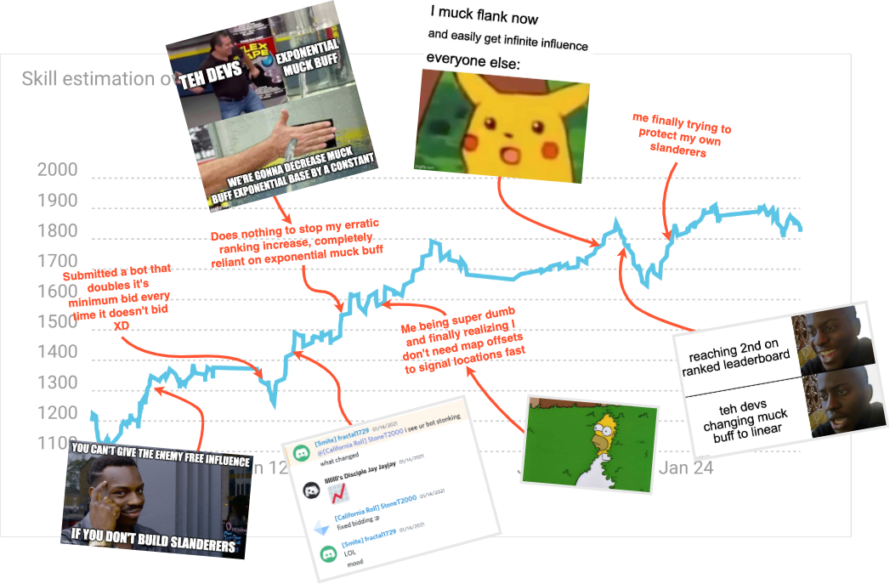

# Battlecode 2021 - Team California Roll

This is my repository for my Battlecode 2021 code. 

My team name this year was California Roll and I soloed this year again (did have a teammate for about a week but he unfortunately dropped). I made finals and got 9th! Unfortunately 4 rankings lower than last year, but again, RNG is the essense of Battlecode. In fact, this years winners, team babyducks, lost in the round of 16, only to then win every single match from the loser's bracket to take home 1st place! As team smite always say, maps win games.

Also I won the "Adaptive Strategy" award, which was a special award given to me since I spearheaded the development of a really useful strategy this year known as "muck flanking." I'm quite sure I wasn't the first team to have some form of "muck flanking" but it appears that I was the first to give it a name and talk about it and show people it's effects (it worked quite well against babyducks at one point!)

My final submission is in `src/maxecosushi`. The bot names are a bit unintuitive in terms of what tournament I submitted them for but they are named after my current feelings / strategies at the time to some extent. 

I'll also be posting a postmortem soon on my [blog](https://www.stoneztao.com/blog/) and will link other postmortems here as they get posted around the internet / the battlecode discord.

This code is very very messy. I'm not sure how helpful it is to read bot code, even amongst the other top bots, other than to learn about some of the neat bytecode optimizing tricks teams might employ. In my case, the only stand out "code" are my custom data structures that save a significant amount of bytecode (although they are far from perfect). Otherwise, have fun trying to understand my strategy! And feel free to compete against it :)

Also, for a tldr; of Battlecode 2021 and my bot in relation to Battlecode, this summarizes it quite concisely:

